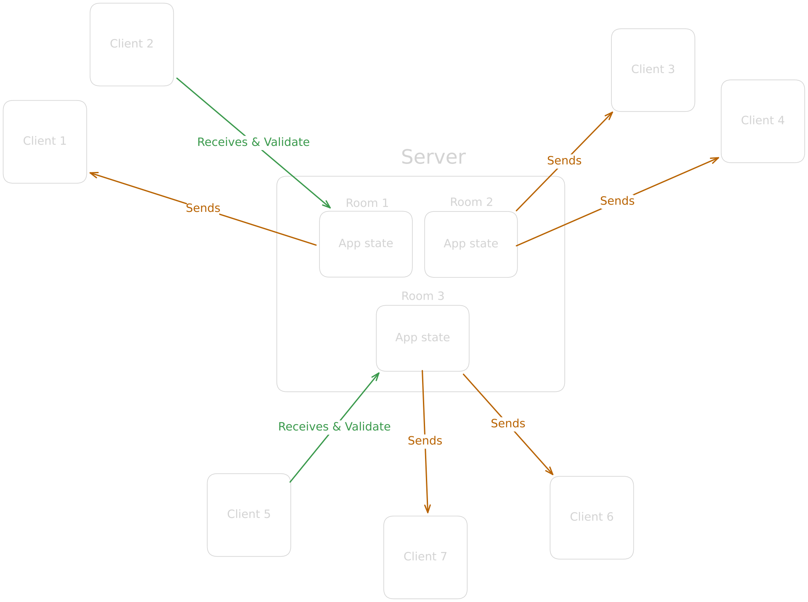

# Skribio Server

Il server di **Skribio** è implementato in **Go** e gestisce la comunicazione in tempo reale tra client tramite **WebSocket**.

## Panoramica

Il server è organizzato attorno al concetto di **stanze**. Ogni stanza permette a più client di connettersi e collaborare simultaneamente in tempo reale.

Le funzionalità principali includono:

* Creazione e gestione dinamica delle stanze
* Validazione dello stato dell’applicazione
* Sincronizzazione dei dati tra tutti i client collegati alla stessa stanza

---

## Architettura del server



L’immagine sopra mostra la struttura interna del server e come i componenti interagiscono tra loro per gestire connessioni WebSocket e stanze multiple.

---

## Messaggi clients-server

Il pacchetto **`wsproto`** definisce la struttura del protocollo utilizzato da **Skribio** per la comunicazione in tempo reale tra client e server.

### Struttura del messaggio

Ogni messaggio è un JSON suddiviso in due sezioni principali:

1. **Header**: indica il tipo di messaggio, che il client o il server deve interpretare.
2. **Body**: contiene i dati specifici per il tipo di messaggio, sempre in formato JSON.

#### Esempio di definizione di tipo (Go)

```go
const INFO_ES HeaderType = 0
```

#### Esempio di messaggio JSON

```json
{
    "Header": 0,
    "Body": {
        "Info1": "queste sono informazioni aggiuntive",
        "Info2": "specifiche per il tipo di messaggio"
    }
}
```

* **Header**: identifica il tipo di messaggio (*INFO_ES* in questo caso).
* **Body**: contiene i dati extra necessari all’elaborazione del messaggio.

